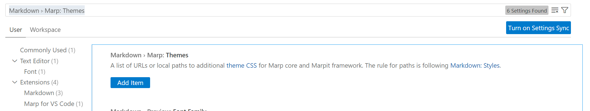

# HKUST(GZ) [Marpit](https://marpit.marp.app/) Template for Presentation

## Introduction

Marpit Presentation Template for The Hong Kong University of Science and Technology (Guangzhou) (HKUST(GZ)), the

### Advantage of Markdown

- No worry to layout, just focus on what you want to present.
- Easy to design your own theme
- No large software installation required

### Markdown VS LateX

To be completed


| Item | Markdown | Latex |
| ------ | ---------- | ------- |
|      |          |       |
|      |          |       |
|      |          |       |

## Usage

### Download the template and theme

In [Release]() page, click the compressed file related to your university,

### Install VScode add-ons

In VScode market space, search [Marp for VS Code](https://marketplace.visualstudio.com/items?itemName=marp-team.marp-vscode) and click install,


if you are new to Markdown on VS Code you should also install [Markdown All in One](https://marketplace.visualstudio.com/items?itemName=yzhang.markdown-all-in-one) on your VS Code.

### Add theme

- Copy the `theme` folder to your workspace
- In the `theme` dictionary, **right click** the theme file and select `copy relative path`
- Open settings of VS Code, search `Markdown › Marp: Themes`, click the `Add item` buttom and paste the path you copied.



### Write markdown

You can write your markdown code from the template, or just copy the config below to the beginning of your file.

```yaml
---
marp: true
theme: HKUSTGZStd
paginate: true
size: 1080P

header: ''
footer: 'Your Presentation, Name, Date, or Conference'
---
```

You can click the Markdown Preview button to see the rendered view.

### Export your slide

Clicking the Marpit button on the upper-rightt, and you can export the slides with `Export Side Deck` .

## Want to customise your slide?

### I am not from HKUST(GZ)

Currently, we have prepared special release for students from Southern University of Science and Technology (SUSTech) and San Yan-san University (SYSU), you can download the pack from [release]() page.

Other wise, you can change the settings by your self.

#### Change the color

To be completed.

#### Change the Logo

To be completed.

## Resource for reference

### Markdown syntax

Please refer to [Markdown Guide](https://www.markdownguide.org/)

### More about Marpit

If you are interested in Marpited, you can refer to [its website](https://marpit.marp.app).

## What's NEXT

### For Inter-University Friendship

> The specially design version for SUSTech and SYSU will keep updatig with the HKUST(GZ)/HKUST vesion

### Further Developing

#### Global Settings

- [ ] Add special size preset for display in large lecture hall
- [ ] Adjust header and footer design

#### Resources

- [ ] Design better title page decoration
- [ ] Design background for content page

#### Style

- [ ] Adjust the style for body/content
- [ ] Adjust the style for lists
- [ ] Adjust the style for table

#### Image

* [ ] Add caption to the image

#### Advanced Layout Design

- [ ] Two column layout

#### File structure

* [ ] Generate / Store the image and css settings online.
* [ ] Intergrate all the css files in one.

### Other projects on the way

- [ ] HKUST(GZ) Marpit Slide Template: Dark mode
- [ ] HKUST(GZ) Marpit Slide Template: For online conference
- [ ] HKUST(GZ) Marpit Slide Template: For homework
- [ ] HKUST(GZ) Latex Slide Template
- [ ] HKUST(GZ) Latex Report Template
